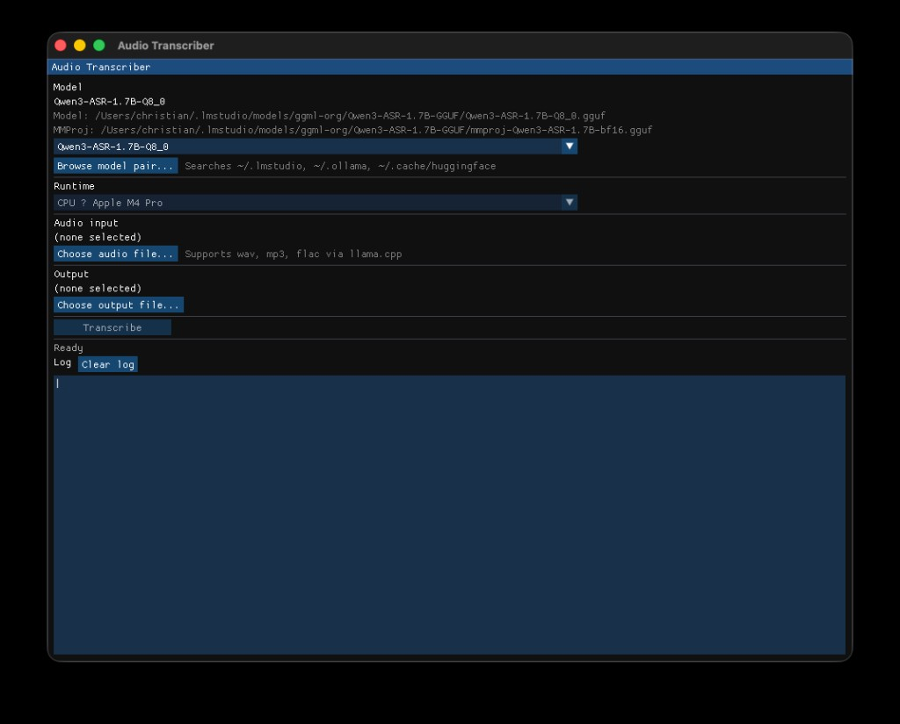

# Open Audio Transcriber

**Open Audio Transcriber** is a desktop app that transcribes audio files to text **entirely on your machine**. Nothing is uploaded to the cloud — your audio and transcripts stay local.

Inference runs with [llama.cpp](https://github.com/ggml-org/llama.cpp) and a small local ASR model (default: [Qwen3-ASR-1.7B](https://huggingface.co/ggml-org/Qwen3-ASR-1.7B-GGUF), about **2 GB** on disk for the main GGUF plus mmproj). You download the model once, pick wav/mp3/flac files, and transcribe offline.



Built with:

- [llama.cpp.zig](https://github.com/Deins/llama.cpp.zig) — vendored under `deps/llama.cpp.zig` (llama.cpp submodule updated to current master for ASR/mtmd support)
- [zgui](https://github.com/zig-gamedev/zgui) + [zglfw](https://github.com/zig-gamedev/zglfw) — Dear ImGui desktop UI
- llama.cpp `libmtmd` — multimodal audio encoder (wav/mp3/flac via miniaudio)

## Local-first

- **Private** — transcription runs on your CPU or GPU; no account or API key.
- **Offline-capable** — after you have the model files, the app does not need network access to transcribe.
- **Small model** — the default Qwen3-ASR setup is roughly **2 GB** total (model + mmproj); larger or smaller quantizations are supported if you browse to another pair.

## Default model

The default model is **ggml-org/Qwen3-ASR-1.7B**, expected at:

```
~/.lmstudio/models/ggml-org/Qwen3-ASR-1.7B-GGUF/
  Qwen3-ASR-1.7B-Q8_0.gguf
  mmproj-Qwen3-ASR-1.7B-bf16.gguf
```

Both the main GGUF and matching `mmproj` file are required. Download them from Hugging Face or pull them via LM Studio — they remain on your disk and are loaded locally at runtime.

## Model discovery

On startup the app scans:

- `~/.lmstudio/models`
- `~/.ollama/models`
- `~/.cache/huggingface/hub`

It pairs each `*.gguf` model with a sibling `mmproj-<same-stem>.gguf` when present.

Use the model dropdown or **Browse model pair...** / right-click context menu to pick a different model. Your choice is saved to `~/.config/audio-transcriber/config.json`.

## Requirements

- Zig 0.16+
- CMake (e.g. `brew install cmake`)
- macOS with Xcode command-line tools (Metal backend)
- A Qwen3-ASR GGUF + mmproj pair on disk (~2 GB for the default setup; see above)

## Build & run

```bash
zig build
zig build run
```

The first build compiles llama.cpp via CMake into `.zig-cache/llama-cpp/` (may take a few minutes).

### Windows (Vulkan GPU)

Install the [LunarG Vulkan SDK](https://vulkan.lunarg.com/), then set `VULKAN_SDK` and build with the Vulkan backend enabled:

```powershell
$env:VULKAN_SDK = "C:/VulkanSDK/1.4.350.0"   # adjust to your install path
zig build -Dggml-vulkan=true -Doptimize=ReleaseFast
zig build run -Dggml-vulkan=true -Doptimize=ReleaseFast
```

`VULKAN_SDK` must be set whenever you build with `-Dggml-vulkan=true`. The first Vulkan build is slower (shader compilation). Use the **Runtime** dropdown in the app to pick CPU or Vulkan.

CPU-only on Windows (no Vulkan SDK):

```powershell
zig build -Doptimize=ReleaseFast
zig build run -Doptimize=ReleaseFast
```

### Linux (Vulkan GPU)

Install Vulkan development packages (Arch/CachyOS example):

```bash
sudo pacman -S vulkan-devel glslang spirv-headers
```

Then build with the Vulkan backend:

```bash
zig build -Dggml-vulkan=true -Doptimize=ReleaseFast
zig build run -Dggml-vulkan=true -Doptimize=ReleaseFast
```

If you use the LunarG Vulkan SDK instead of system packages, set `VULKAN_SDK` when building. The first Vulkan build is slower (shader compilation). Use the **Runtime** dropdown in the app to pick CPU or Vulkan.

Vulkan runs the text model on the GPU; the audio encoder (mmproj) stays on CPU for stability.

Context size is chosen automatically from audio length (long files need a larger context — about 12 minutes of audio uses ~18k tokens).

CPU-only on Linux:

```bash
zig build -Doptimize=ReleaseFast
zig build run -Doptimize=ReleaseFast
```

### Linux package (desktop entry + icons)

Build a local install tree with the binary, launcher icon, and `.desktop` file:

```bash
zig build package -Doptimize=ReleaseFast
```

Requires ImageMagick (`magick` or `convert`) to resize `packaging/app-icon.png` into theme icons.

Output layout:

```
zig-out/bin/audio-transcriber
zig-out/share/applications/audio-transcriber.desktop
zig-out/share/icons/hicolor/*/apps/audio-transcriber.png
```

Run from the prefix without installing system-wide:

```bash
export PATH="$PWD/zig-out/bin:$PATH"
export XDG_DATA_DIRS="$PWD/zig-out/share:${XDG_DATA_DIRS:-/usr/local/share:/usr/share}"
audio-transcriber
```

Or copy `zig-out/bin/audio-transcriber` to `~/.local/bin` and the `share/` tree to `~/.local/share`.

The app embeds window icons from `src/assets/` (generated from `packaging/app-icon.png`) for the GLFW window icon on X11. On Wayland, the taskbar icon comes from the installed hicolor icons and `.desktop` entry.

### Copying the .exe to another PC

Release builds use `-march=native` for llama.cpp CPU code, so an `.exe` built on one PC may crash on another with **illegal instruction** (`0xc000001d`) at startup. Rebuild with a portable CPU baseline before copying:

```powershell
$env:VULKAN_SDK = "C:/VulkanSDK/1.4.350.0"   # if using Vulkan
zig build -Dcpu-baseline=true -Dggml-vulkan=true -Doptimize=ReleaseFast
```

Copy `zig-out\bin\audio-transcriber.exe` (and `audio-transcriber.pdb` if you want crash symbols). The target PC still needs up-to-date GPU drivers for Vulkan; CPU-only builds have no extra runtime dependencies.

## Package (standalone macOS app)

Build a release `.app` bundle you can copy to `/Applications`:

```bash
zig build package -Doptimize=ReleaseFast
```

Output:

```
zig-out/Audio Transcriber.app
```

Open it from Finder or run:

```bash
open "zig-out/Audio Transcriber.app"
```

The bundle contains only the app binary and `Info.plist`. ASR model files are still loaded from disk (default: `~/.lmstudio/models/...`) or chosen via **Browse model pair...** in the UI.

To refresh a local copy in the project folder:

```bash
rm -rf "Audio Transcriber"
cp -R "zig-out/Audio Transcriber.app" "Audio Transcriber"
```

### Code signing

Signing is optional. Pass `-Dcodesign-identity` to sign as part of `zig build package`.

Ad-hoc signing (fine for local use on your Mac):

```bash
zig build package -Doptimize=ReleaseFast -Dcodesign-identity=-
```

Developer ID signing (for distribution; requires a valid certificate in your keychain):

```bash
zig build package -Doptimize=ReleaseFast \
  -Dcodesign-identity="Developer ID Application: Your Name (TEAMID)"
```

List available signing identities:

```bash
security find-identity -v -p codesigning
```

Optional entitlements plist:

```bash
zig build package -Doptimize=ReleaseFast \
  -Dcodesign-identity="Developer ID Application: Your Name (TEAMID)" \
  -Dcodesign-entitlements=packaging/entitlements.plist
```

For distribution outside your Mac, notarize the signed `.app` with Apple after packaging.

## Usage

1. Install a local ASR model (default: Qwen3-ASR-1.7B, ~2 GB) if you have not already.
2. Confirm or select an ASR model in the app (default path: LM Studio models folder).
3. Choose an audio file (wav, mp3, flac).
4. Choose an output `.txt` path (defaults to `<audio-stem>.txt`).
5. Click **Transcribe** — processing stays on your machine.

## Agent / handoff context

For continuing development on another machine (e.g. Windows port), see **[docs/AGENT_CONTEXT.md](docs/AGENT_CONTEXT.md)** — architecture, macOS fixes, and Windows port checklist.

## Notes

- llama.cpp.zig upstream targets Zig 0.14 and an older llama.cpp without ASR. This project vendors llama.cpp.zig but uses a current llama.cpp submodule and links `libmtmd` built by CMake.
- GPU acceleration uses Metal on macOS (`-DGGML_METAL=ON`), or Vulkan on Windows and Linux (`-Dggml-vulkan=true`; Windows needs Vulkan SDK, Linux needs system Vulkan dev packages or `VULKAN_SDK`).
- Audio transcription in llama.cpp is still marked experimental upstream.
